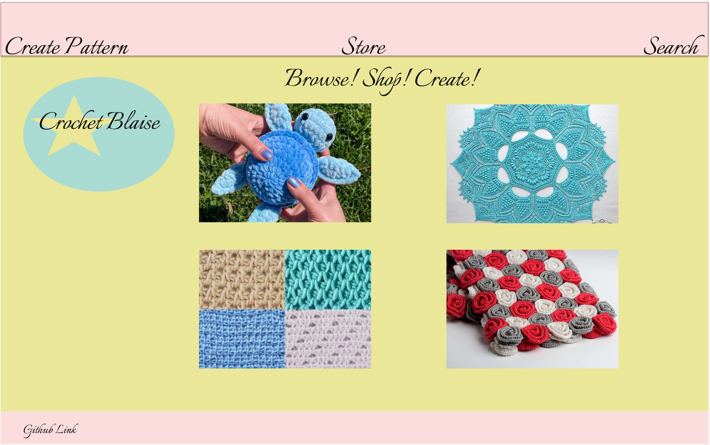
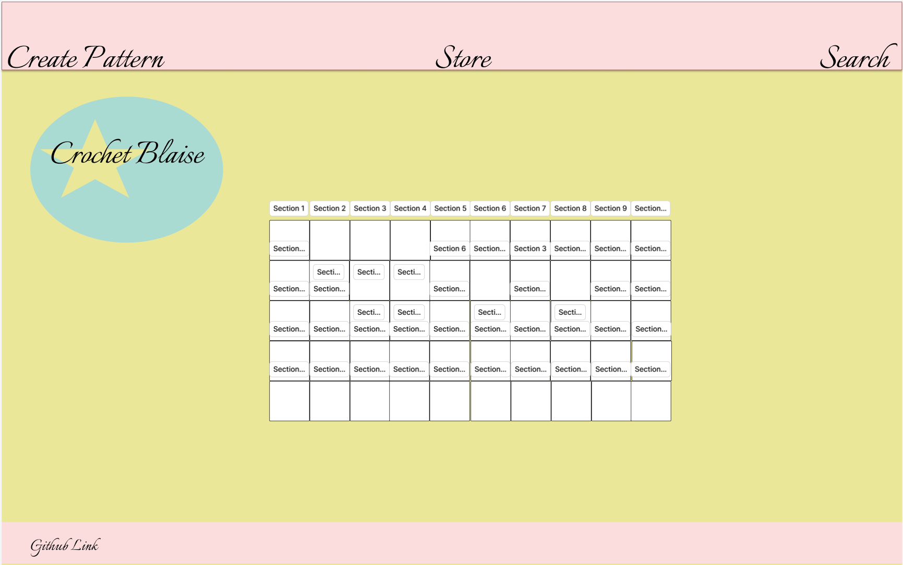
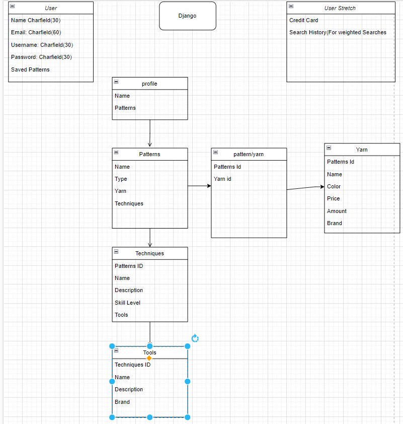
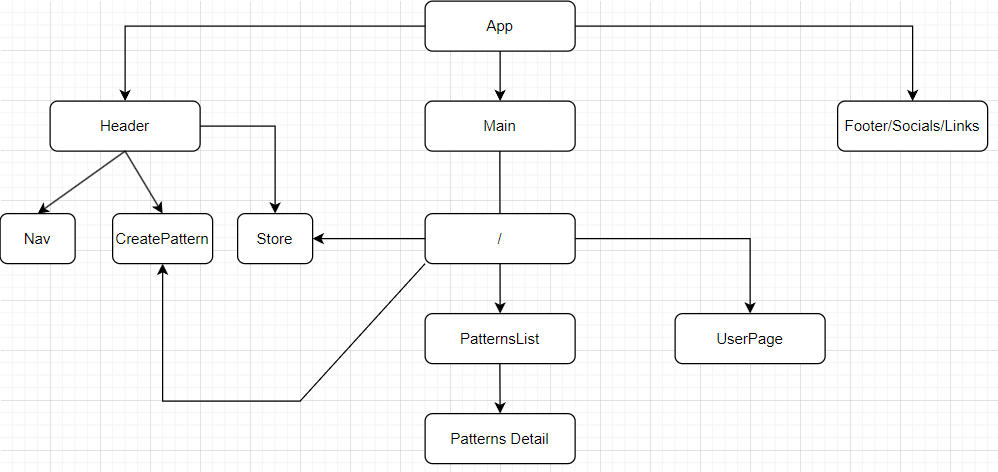

# ***Chrochet-Blaise***

Crochet Blaise is a webpage designed to inspire and help people create their own crochet creations. Browse the page for designs, and click on them for more detailed information about the techniques and tools used to create the patterns. Or, users can upload their own patterns to inspire their fellow chrocheters to create their own masterpieces.

## ERD

## Wireframes

## [Trello](https://trello.com/b/0zJyAGW2/capstone)

## Technologies Used

React JS - Front end
 
Django - Database

## Resources Used

